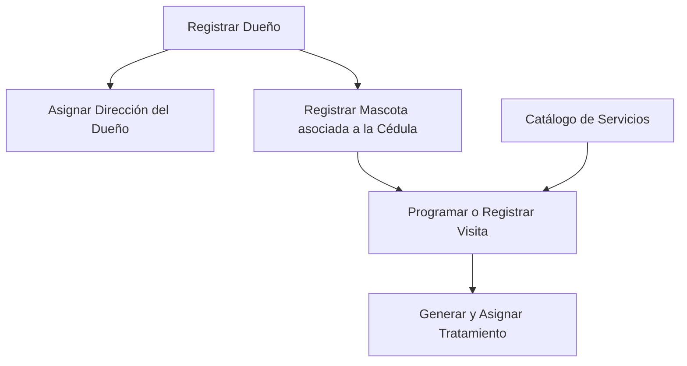

# Diseño de base de datos   Veterinaria Mi Mejor Amigo
<br>

## Modelo Entidad-Relación y Flujo de Datos

A continuación se representa la arquitectura relacional del sistema de gestión veterinaria, estructurada desde los registros primarios hasta las transacciones y tratamientos.

### Diagrama de Relaciones (ERD)

```mermaid
Diagrama E-R


    DUEÑOS ||--o{ DIRECCION : "registra / posee"
    DUEÑOS ||--o{ MASCOTA : "es dueño de"
    MASCOTA ||--o{ VISITAS : "realiza"
    SERVICIOS ||--o{ VISITAS : "se incluye en"
    VISITAS ||--o{ TRATAMIENTO : "genera / prescribe"

    DUEÑOS {
        VARCHAR_200 Cedula PK
        VARCHAR_400 nombre_completo
        VARCHAR_45 telefono
    }

    DIRECCION {
        INT id_Direccion PK
        VARCHAR_100 Ciudad
        VARCHAR_100 Zona
        VARCHAR_100 Calle
        VARCHAR_100 Avenida
        VARCHAR_100 Numero_de_casa
        VARCHAR_200 Dueños_Cedula FK
    }

    MASCOTA {
        INT id_Mascota PK
        VARCHAR_100 Nombre
        VARCHAR_100 Especie
        VARCHAR_100 Raza
        VARCHAR_100 Edad
        VARCHAR_100 Sexo
        TINYINT Vacunado
        VARCHAR_200 Dueños_Cedula FK
    }

    SERVICIOS {
        INT id_Servicio PK
        VARCHAR_200 Nombre_de_Servicios
        VARCHAR_300 Descripcion_servicio
        DECIMAL_100 Precio
    }

    VISITAS {
        INT id_Visita PK
        DATETIME fecha_servicio
        INT Mascota_id_Mascota FK
        INT Servicios_id_Servicio FK
    }

    TRATAMIENTO {
        INT id_Tratamiento PK
        VARCHAR_100 Nombre_tratamiento
        VARCHAR_500 Observaciones_tratamiento
        INT Visitas_id_Visita FK
    }
```

---

### Diagrama de Flujo Lógico de Procesos



---

### Descripción del Flujo Relacional

1. **Gestión de Dueños y Ubicación (`Dueños` ↔ `Direccion`):**
   * **Relación (1 a N):** Un cliente/dueño se identifica por su `Cedula` (Primary Key) y puede tener asociadas una o varias direcciones registradas a través del campo foráneo `Dueños_Cedula`.

2. **Propiedad de Pacientes (`Dueños` ↔ `Mascota`):**
   * **Relación (1 a N):** Cada dueño registrado puede estar vinculado a múltiples mascotas registradas en el sistema.

3. **Atención y Servicios (`Mascota` + `Servicios` ↔ `Visitas`):**
   * **Entidad Pivote/Transaccional (`Visitas`):** Funciona como punto de encuentro transaccional entre el paciente (`Mascota`) y la prestación ofertada (`Servicios`), registrando la estampa de tiempo (`fecha_servicio`).

4. **Seguimiento Clínico (`Visitas` ↔ `Tratamiento`):**
   * **Relación (1 a N):** A partir de una visita realizada, el profesional de salud veterinaria prescribe uno o más tratamientos específicos asociados a la `id_Visita`.

