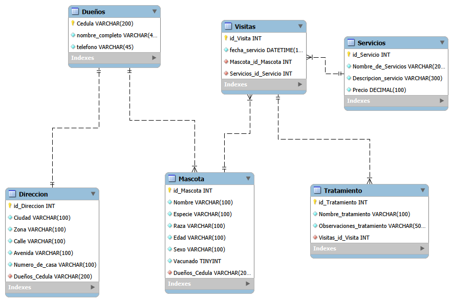
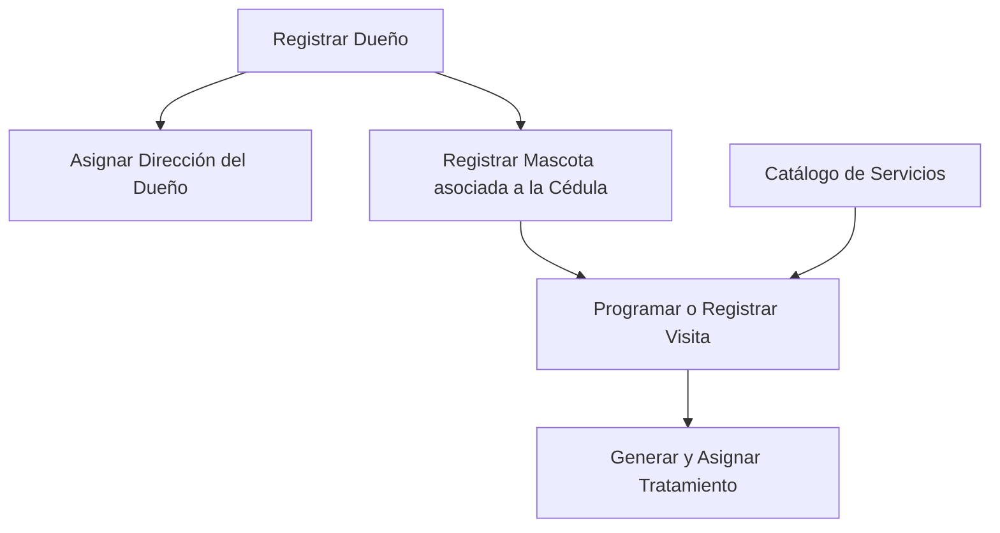

# Diseño de base de datos   Veterinaria Mi Mejor Amigo
<br>

## Modelo Entidad-Relación y Flujo de Datos

A continuación se representa la arquitectura relacional del sistema de gestión veterinaria, estructurada desde los registros primarios hasta las transacciones y tratamientos.

### Diagrama de Relaciones (ERD)
<p align="center">
  
</p>

```mermaid
Diagrama E-R


    DUEÑOS ||--o{ DIRECCION : "registra / posee"
    DUEÑOS ||--o{ MASCOTA : "es dueño de"
    MASCOTA ||--o{ VISITAS : "realiza"
    SERVICIOS ||--o{ VISITAS : "se incluye en"
    VISITAS ||--o{ TRATAMIENTO : "genera / prescribe"

La tabla dueños contendra la informacion de los dueños que relacionara con sus mascotas, como llave primaria se seleccion la cedula ya que es un documento no tranferible y unico por eso se tomo como la Primary Key.

    DUEÑOS {
        VARCHAR_200 Cedula PK
        VARCHAR_400 nombre_completo
        VARCHAR_45 telefono
    } 

La creacion de la tabla direccion se debe un mejoramiento de la base de datos obteniendo la informacion de la direccion del dueño por si este tenga mas de una direccion. La llave primaria es auto incremental segun se ingresen recursos. 


    DIRECCION {
        INT id_Direccion PK
        VARCHAR_100 Ciudad
        VARCHAR_100 Zona
        VARCHAR_100 Calle
        VARCHAR_100 Avenida
        VARCHAR_100 Numero_de_casa
        VARCHAR_200 Dueños_Cedula FK
    }

Tabla Mascota contendra la informacion de la mascota y tiene relacion con dueños y visitas. La llave primaria es auto incremental.

    MASCOTA {
        INT id_Mascota PK
        VARCHAR_100 Nombre
        VARCHAR_100 Especie
        VARCHAR_100 Raza
        VARCHAR_100 Edad
        VARCHAR_100 Sexo
        TINYINT Vacunado
        VARCHAR_200 Dueños_Cedula FK
    }

Tabla servicio contendra la informacion de los servicios y tiene relacion con visitas. La llave primaria es auto incremental.

    SERVICIOS {
        INT id_Servicio PK
        VARCHAR_200 Nombre_de_Servicios
        VARCHAR_300 Descripcion_servicio
        DECIMAL_100 Precio
    }

Tabla Visitas contendra la informacion de la mascota que visiten la veterinaria y tiene relacion con Servicios. La llave primaria es auto incremental.

    VISITAS {
        INT id_Visita PK
        DATETIME fecha_servicio
        INT Mascota_id_Mascota FK
        INT Servicios_id_Servicio FK
    }

Tabla Tratamiento contendra la informacion de los tratamientos de la mascota y tiene relacion con visitas. La llave primaria es auto incremental.
    
    TRATAMIENTO {
        INT id_Tratamiento PK
        VARCHAR_100 Nombre_tratamiento
        VARCHAR_500 Observaciones_tratamiento
        INT Visitas_id_Visita FK
    }
```

---

### Diagrama de Flujo Lógico de Procesos



---

### Descripción del Flujo de Relacion de la Base de Datos

1. **Gestión de Dueños y Ubicación (`Dueños` ↔ `Direccion`):**
   * **Relación (1 a N):** Un cliente/dueño se identifica por su `Cedula` (Primary Key) y puede tener asociadas una o varias direcciones registradas a través del campo foráneo `Dueños_Cedula`.

2. **Propiedad de Pacientes (`Dueños` ↔ `Mascota`):**
   * **Relación (1 a N):** Cada dueño registrado puede estar vinculado a múltiples mascotas registradas en el sistema.

3. **Atención y Servicios (`Mascota` + `Servicios` ↔ `Visitas`):**
   * **Entidad Pivote/Transaccional (`Visitas`):** Funciona como punto de encuentro transaccional entre el paciente (`Mascota`) y la prestación ofertada (`Servicios`), registrando la estampa de tiempo (`fecha_servicio`).

4. **Seguimiento Clínico (`Visitas` ↔ `Tratamiento`):**
   * **Relación (1 a N):** A partir de una visita realizada, el profesional de salud veterinaria prescribe uno o más tratamientos específicos asociados a la `id_Visita`.

